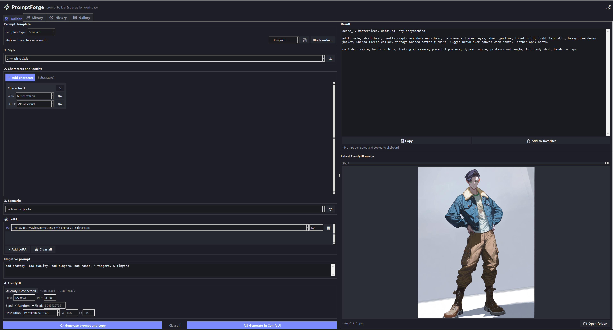
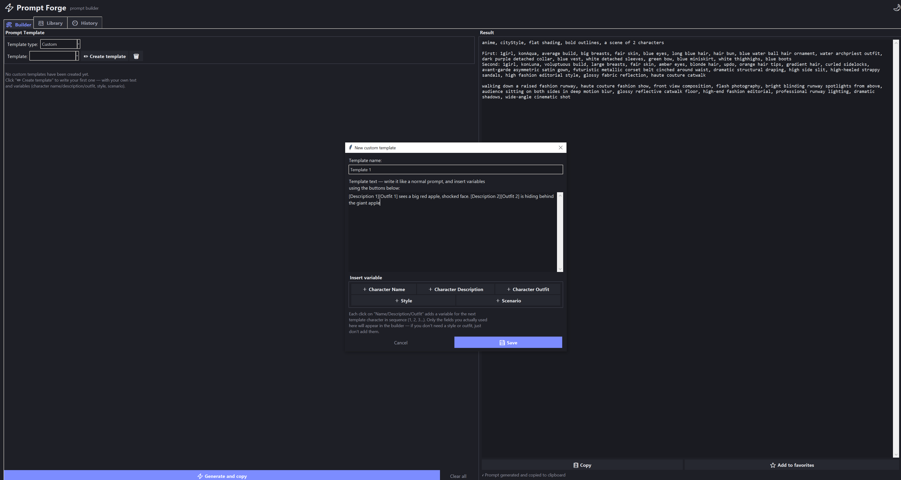
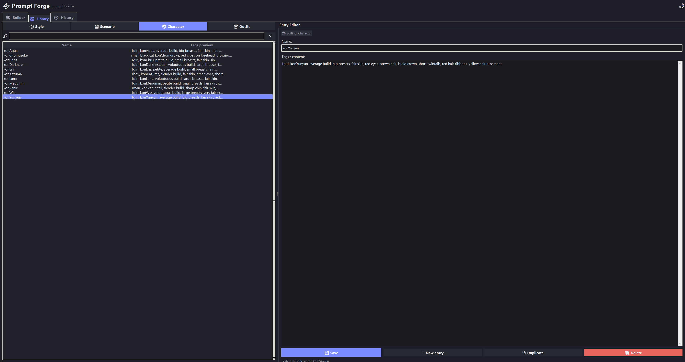
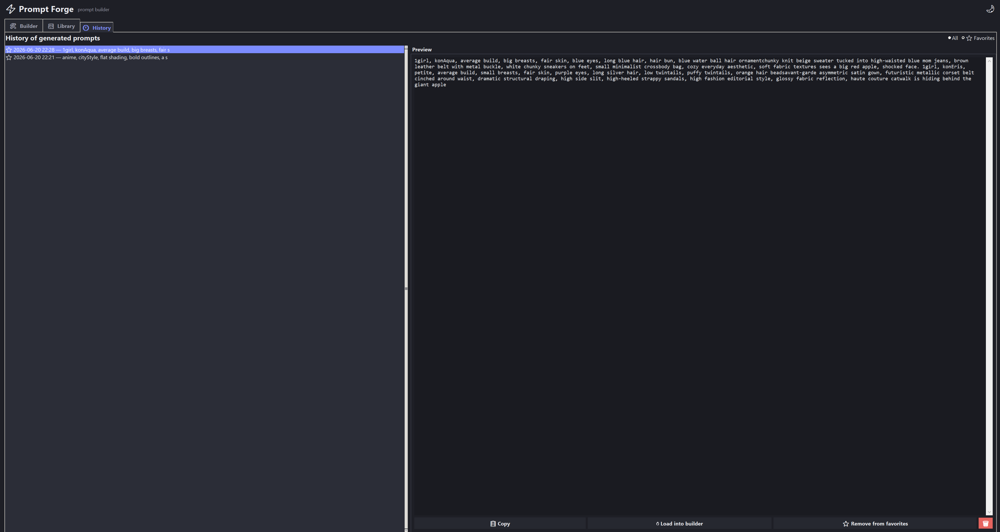

# ⚡ PromptForge

A desktop app for building AI image-generation prompts out of reusable
building blocks — **styles**, **characters**, **outfits**, and
**scenarios** — instead of retyping the same tags every time, and for
driving those prompts straight into a running **ComfyUI** instance with
live preview, LoRA management, and a results gallery.



## Features

- **Standard builder** — pick a style, add any number of characters with their outfits, pick a scenario, and generate a ready-to-paste prompt with one click. Reorder the assembled blocks (style / characters / scenario) however you like, and save your favorite orderings as reusable templates.
- **Custom templates** — write your own prompt skeleton with placeholders like `[Name 1]`, `[Description 1]`, `[Outfit 1]`, `[Style]`, `[Scenario]`, and fill them in from dropdowns each time you generate.
- **Direct ComfyUI generation** — connect to a running ComfyUI instance (via the companion custom node) and send your assembled prompt straight to it with **🎨 Generate in ComfyUI**, no copy-pasting. Watch live preview frames while it samples, and get the finished image back in the Builder tab and the Gallery. Prefer to just build the text? **⚡ Generate prompt and copy** still does that, with or without ComfyUI connected. See [Connecting to ComfyUI](#connecting-to-comfyui) below.
- **LoRA Manager** — attach LoRAs to a generation either manually or automatically (pulled from whichever library entries — characters, outfits, styles — are bound to one), tagged `[M]`/`[A]` so you always know which is which. Validated against ComfyUI's live LoRA list before every submit, so a missing file is caught up front instead of silently skipping.
- **Library manager** — a built-in editor for your styles, scenarios, characters, and outfits, with search, per-character "canon" outfits, an optional source URL per entry (for crediting/finding the original model or reference), and an optional bound LoRA (used by the LoRA Manager's auto slots).
- **Reference images** — attach a preview image to any library entry by dragging a file onto the editor or clicking to browse. Images are auto-converted, resized, and saved next to their entry. The preview size is adjustable with a slider and remembered between sessions.
- **History** — every generated prompt is saved automatically, with favorites and one-click restore back into the builder.
- **Gallery** — every image generated through ComfyUI this session shows up as a thumbnail, with hover-to-reveal-in-explorer and click-to-open-full-size.
- **Light / dark theme** toggle.
- All data is stored locally in plain `.txt` / `.json` / `.jpg` files — easy to back up, sync, or edit by hand.

## Screenshots

| Builder | Custom templates |
|---|---|
|  |  |

| Library | History |
|---|---|
|  |  |

## Getting started

### Requirements

- Python 3.9+ (Windows, macOS, or Linux)
- [`Pillow`](https://pypi.org/project/pillow/) — image conversion, resizing, and previews for library reference images and the Gallery
- [`tkinterdnd2`](https://pypi.org/project/tkinterdnd2/) — native drag-and-drop support for attaching images
- `tkinter` is required and ships with most standard Python installs (on some Linux distros it's a separate package, e.g. `sudo apt install python3-tk`)
- A running [ComfyUI](https://github.com/comfyanonymous/ComfyUI) instance with the **PromptForge Connection** custom node package installed — only if you want direct ComfyUI generation. Everything else works fully without it.

### Run from source

```bash
pip install pillow tkinterdnd2
python promptforgeint.py
```

If `tkinterdnd2` isn't installed, the app still runs — drag-and-drop is simply disabled and you can still attach images via the click-to-browse picker. If `Pillow` isn't installed, image attachment and the Gallery are disabled entirely (everything else works as normal).

On first launch, a `prompt_forge_data/` folder is created right next to the program — see [Data & storage](#data--storage).

## Building a standalone Windows .exe (with a custom icon)

1. Convert your icon artwork to a `.ico` file (multi-resolution: 16–256px). Either:
   - use a free online converter (e.g. [icoconvert.com](https://icoconvert.com), [convertio.co](https://convertio.co/png-ico/)), or
   - locally with Pillow:
     ```bash
     pip install pillow
     ```
     ```python
     from PIL import Image
     Image.open("icon_1080.png").save(
         "icon.ico", sizes=[(16,16),(32,32),(48,48),(64,64),(128,128),(256,256)]
     )
     ```
2. Place `icon.ico` in the same folder as `promptforgeint.py`. The app picks it up automatically at startup (window/taskbar icon) — no code changes needed.
3. Install PyInstaller and the app's runtime dependencies, then build:
   ```bash
   pip install pyinstaller pillow tkinterdnd2
   pyinstaller --onefile --windowed --icon=icon.ico --name "PromptForge" --collect-all tkinterdnd2 promptforgeint.py
   ```
   The `--collect-all tkinterdnd2` flag is required — PyInstaller doesn't automatically bundle that package's bundled Tcl/Tk drag-and-drop library, and the .exe will fail to launch without it.
4. Grab the result from `dist/PromptForge.exe`, and copy `icon.ico` into that same `dist/` folder (the app looks for it next to the executable at runtime).
5. Run `PromptForge.exe` — it will create its own `prompt_forge_data/` folder right beside it on first launch, same as running from source.

## Connecting to ComfyUI

Direct generation requires the companion **PromptForge Connection**
custom node package installed in `ComfyUI/custom_nodes/` (separate
install — see that package's own README for setup and graph wiring).

1. Place a **PromptForge Connector** node in your ComfyUI graph (and,
   optionally, a **PromptForge Multi Lora Loader**), wired up per the
   node package's README.
2. In PromptForge's Builder tab, open the **4. ComfyUI** panel and tick
   **"ComfyUI connected?"**.
3. Build your prompt as usual, then either:
   - **⚡ Generate prompt and copy** — assembles the prompt and copies it
     to the clipboard, same as always, ComfyUI untouched.
   - **🎨 Generate in ComfyUI** — patches your prompt/negative
     prompt/seed/resolution (and LoRA Manager selections, if any) into
     the live graph and submits it. The **"Latest ComfyUI image"** panel
     shows live preview frames while it samples, then the finished
     result — which also lands in the **Gallery** tab.

Live preview depends entirely on ComfyUI's own **Settings → Comfy →
Execution → Live preview method**. If it's set to `none`, no frames
arrive — that's ComfyUI's setting, not a PromptForge toggle.

### ⚠️ Generation always targets the *last active* workflow in the browser

PromptForge has no concept of "which workflow you meant" — it asks the
bridge for whatever graph was most recently active in the ComfyUI
browser tab, and submits to that. Concretely:

- If you have two workflows open — say **Anima** and **Klein**, each
  with a Connector node — and **Klein** was the last tab you clicked on
  (even just to glance at it, no editing required), your next
  **🎨 Generate in ComfyUI** goes to Klein. You can close that tab
  immediately afterward; the generation still runs.
- Click over to the Anima tab and back, and the next generation goes to
  Anima instead — LoRAs included.
- This has only been confirmed with the ComfyUI browser tab open
  somewhere (even backgrounded); fully quitting the browser entirely
  hasn't been tested.
- Example workflow JSONs (Anima, Klein, Qwen Image), pre-wired with the
  Connector node, are included to make this concrete rather than just
  read about.

**Rule of thumb:** whichever ComfyUI workflow tab was open last is where
the job is going.

## Known issues

- **Theme toggle doesn't fully recolor every widget.** Switching between
  light and dark theme can leave a few widgets with their old colors
  until the app is restarted. This is a Tkinter rendering quirk, not a
  data issue — nothing is lost, it's purely cosmetic. A proper fix is
  planned alongside a future migration of the UI to PyQt6 or PySide6;
  until then, restart the app after a theme switch if it looks off.

## Known issues

- **Theme toggle doesn't fully recolor every widget.** Switching between
  light and dark theme can leave a few widgets with their old colors
  until the app is restarted. This is a Tkinter rendering quirk, not a
  data issue — nothing is lost, it's purely cosmetic. A proper fix is
  planned alongside a future migration of the UI to PyQt6 or PySide6;
  until then, restart the app after a theme switch if it looks off.
- **Crash when enabling ComfyUI integration in windowed mode.** The app 
  may occasionally crash or freeze if you toggle the ComfyUI connection 
  while running in windowed mode. This behavior depends entirely on your 
  display resolution and the default window dimensions at startup. It is 
  a known UI rendering bottleneck related to how the underlying libraries 
  (`tkinter` / `tkinterdnd2`) calculate geometry when dynamically injection 
  new layout elements into the "4. ComfyUI" panel. 
  *Workaround:* Maximize the application window before checking the 
  **"ComfyUI connected?"** checkbox.

```
prompt_forge_data/
├── styles/
│   ├── cityStyle.txt
│   ├── cityStyle.jpg          # optional reference image, same name as the entry
│   └── cityStyle.meta.json    # optional: source URL / bound LoRA for this entry
├── scenarios/
├── characters/
│   ├── konYunyun.txt
│   ├── konYunyun.jpg
│   └── konYunyun.meta.json
├── outfits/
├── _templates.json            # saved block-order templates
├── _custom_templates.json     # custom text templates
├── _history.json               # generated-prompt history
├── _settings.json              # theme, image-preview size, and other UI preferences
└── _comfy_previews/            # session-only cache of images pulled from ComfyUI
                                 # (Builder's "Latest image" + Gallery thumbnails);
                                 # wiped on every app restart, never holds your only copy
```

Each library entry's image and metadata (if any) sit right next to its
`.txt` file under the same base name, so renaming, duplicating, or
deleting an entry in the app keeps them in sync automatically.

The `prompt_forge_data/` folder (everything *except* `_comfy_previews/`,
which is just a disposable cache) is fully portable — copy it to another
machine, or back it up, to bring your whole library, history, and
reference images with you.

## Changelog

### v2.0.0 (Current)
- **Direct ComfyUI generation:** a new companion custom node package
  (PromptForge Connection) plus an in-app "4. ComfyUI" panel let you
  submit your built prompt straight to a running ComfyUI instance and
  watch it generate, without leaving PromptForge.
  - **🎨 Generate in ComfyUI** patches prompt / negative prompt / seed /
    width / height (and LoRA Manager selections) into whichever workflow
    is currently active in the ComfyUI browser tab, and submits it.
  - Live preview frames stream into the Builder tab's "Latest ComfyUI
    image" panel while sampling runs, honoring ComfyUI's own Live
    preview method setting.
  - The finished result is downloaded, shown in the Builder tab, and
    added to the new **Gallery** tab.
- **LoRA Manager:** manual and auto (library-bound, tagged `[A]`)
  LoRA slots, validated against ComfyUI's live LoRA list before
  submitting so a missing file is caught immediately instead of
  silently being skipped mid-generation.
- **Library entries gained two optional fields:** a source URL (to credit
  or relocate the original model/reference) and a bound LoRA (feeds the
  LoRA Manager's auto slots).
- **Gallery tab:** every image generated through ComfyUI this session
  appears as a thumbnail, with hover-to-reveal-in-explorer and
  click-to-open-full-size.
- Renamed the entry-point script to `promptforgeint.py`.

### v1.2.0
- **Reference images for library entries:** Every style, scenario, character, and outfit can now have a reference image attached, right inside the Library tab's Entry Editor.
  - Drag a file in or click the preview zone to browse — both save through the same pipeline.
  - Images are automatically converted to optimized `.jpg`, proportionally resized so their longest side is 1024px (never upscaled, aspect ratio always preserved), and saved next to the entry's `.txt` file under the same name.
  - The preview scales to a percentage of the Entry Editor panel's height rather than a fixed pixel size, so it looks proportioned on anything from a 1080p laptop to a 4K monitor.
  - A size slider lets you resize the preview to taste; the value applies to all four categories and is remembered across restarts.
  - Renaming, duplicating, or deleting a library entry keeps its image file in sync automatically — no orphaned images left behind.
  - Falls back gracefully if `Pillow` or `tkinterdnd2` aren't installed (see Requirements below).

### v1.1.0
- **Inline Search in Builder:** Upgraded standard dropdowns (`Who:` and `Outfit:`) to custom autocomplete fields. You can now type directly on the keyboard to filter library elements on the fly.
- **Default Template Refinements:** Fixed text-formatting edge cases in the standard prompt builder:
  - If exactly **1 character** is selected, the redundant `, a scene of 1 characters` prefix is now completely omitted from the final prompt.
  - Automatically appends a trailing period (`.`) to the end of each character's tag block for cleaner prompt structuring and better compatibility with Diffusion models.

## License

This project is released into the public domain under [The Unlicense](https://unlicense.org/).

```
This is free and unencumbered software released into the public domain.

Anyone is free to copy, modify, publish, use, compile, sell, or distribute
this software, either in source code form or as a compiled binary, for any
purpose, commercial or non-commercial, and by any means.

In jurisdictions that recognize copyright laws, the author or authors of
this software dedicate any and all copyright interest in the software to
the public domain. We make this dedication for the benefit of the public
at large and to the detriment of our heirs and successors. We intend this
dedication to be an overt act of relinquishment in perpetuity of all
present and future rights to this software under copyright law.

THE SOFTWARE IS PROVIDED "AS IS", WITHOUT WARRANTY OF ANY KIND, EXPRESS OR
IMPLIED, INCLUDING BUT NOT LIMITED TO THE WARRANTIES OF MERCHANTABILITY,
FITNESS FOR A PARTICULAR PURPOSE AND NONINFRINGEMENT. IN NO EVENT SHALL THE
AUTHORS BE LIABLE FOR ANY CLAIM, DAMAGES OR OTHER LIABILITY, WHETHER IN AN
ACTION OF CONTRACT, TORT OR OTHERWISE, ARISING FROM, OUT OF OR IN
CONNECTION WITH THE SOFTWARE OR THE USE OR OTHER DEALINGS IN THE SOFTWARE.

For more information, please refer to <https://unlicense.org/>
```
